<h1 align="center">HarnessCAD</h1>

<p align="center">
  An agentic text-to-CAD harness: CAD operations are verified before the kernel runs them.
</p>

<p align="center">
  <a href="docs/blueprint.md">Architecture</a> ·
  <a href="docs/corpus/paper-ideas.md">Papers</a> ·
  <a href="docs/corpus/repo-ideas.md">Repos</a> ·
  <a href="#the-argument">The argument</a>
</p>

An agent asks for a 20x10x5 plate, fillets it with radius 8, and shells it with
thickness 9. Every operation is individually well-formed. A CAD kernel accepts
them and returns a solid that is quietly meaningless: the wall consumes the part.

HarnessCAD answers before the kernel is called.

```text
$ harnesscad apply examples/infeasible_plate.json --verify full

[warning] preflight-RADIUS_TOO_LARGE: Fillet radius 8 exceeds half the smallest extent (5) of 'model'.
                                      (Reduce the radius below 2.5.) @op[3]:fillet
[warning] preflight-THICKNESS_TOO_LARGE: Shell thickness 9 leaves no cavity in 'model' (smallest extent 5).
                                      (Reduce the thickness below 2.5.) @op[4]:shell
[error]   infeasible-plan: shell thickness 9 mm >= available stock 5 mm; the wall consumes the whole solid. @op[4]
```

The agent gets a named error to fix, not a stack trace to resample against.

## The argument

This repository is built on one property, and everything else follows from it:

**Soundness, not completeness.** The harness will never ship a wrong part. It
cannot promise to produce a right one. It says no when a plan is infeasible, no
when its backends disagree, and no when it cannot measure the result. What it never
does is say yes to a solid that is quietly wrong. That is a deliberate trade: a tool
that is silent when unsure and loud when certain is worth more, in a domain where a
part gets machined, than a tool that always answers and is sometimes wrong.

Two consequences of that stance are the reason the code is shaped the way it is:

- It verifies the **op stream** before the kernel, so an infeasible plan is a named
  diagnostic and not a meaningless solid (the example above).
- It cross-checks the built geometry across **independent** kernels and measures the
  result exactly, so a wrong part is caught by disagreement or by measurement rather
  than trusted because one kernel returned a number.

## What this is not

- **Not a model.** There is no trained checkpoint here, and no accuracy number to
  quote. The harness is the artifact.
- **Not a CAD kernel.** It ships a kernel-free geometry backend that is good enough
  to be useful and honest about its grid error. For production B-rep it drives OCCT
  (and several other kernels) through the same op stream.
- **Not a benchmark leaderboard that averages.** It runs benchmarks and refuses to
  average incompatible ones, which is a different thing.
- **Not finished.** A large fraction of the modules are still imported by nothing but
  their own test. The count is printed by `harnesscad capabilities --stats`, not
  estimated.
- **Not a paper reproduction.** The domain layer is mined from a large corpus of
  text-to-CAD papers and CAD repositories, and no single one of them is the target.

## Quickstart

```bash
pip install -e .          # stdlib only, no required dependencies
harnesscad demo           # build and verify a constrained plate
```

Build a part, verify it, and write a real STL with no CAD kernel installed:

```bash
harnesscad export plate.stl --backend frep
```

```text
wrote: plate.stl  (403,084 bytes, 8,060 triangles)
volume 994.33   analytic 1000.0   (0.57% under, grid-limited)
closed 2-manifold: yes    genus: 0
```

Signed distance fields compose the ops, marching cubes meshes them, a half-edge
structure proves the result is watertight. No OCCT anywhere in that path.

The harness renders and draws its own output. Both of the images below are produced
by the harness itself, from that mesh, with no external renderer and no numpy: a
z-buffered rasteriser with Lambert shading and crease-aware normals, and a
multi-view drawing with BVH hidden-line removal.

```bash
harnesscad render part.png --view hero    # shaded solid
harnesscad export part.svg                # engineering drawing
```

<p align="center">
  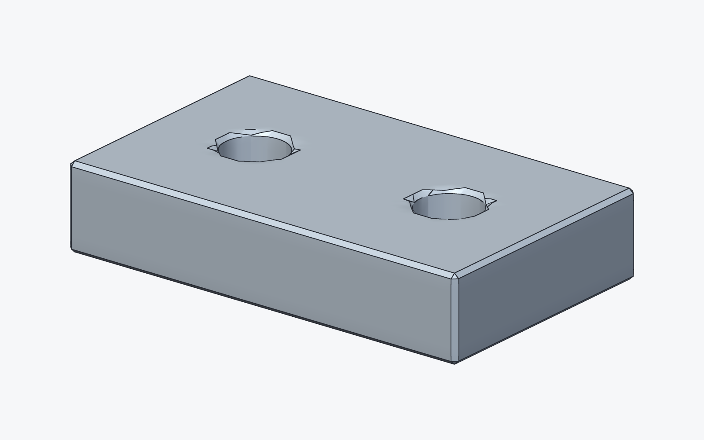
</p>

<p align="center">
  
</p>

Look closely at the hole rims and you can see the cost of a kernel-free backend.
Marching cubes samples a uniform grid, so a 6 mm hole spanning ten cells on a 40 mm
part facets, and the grid meets the top face at a shallow angle. Raising the
resolution smooths it at the price of a denser mesh. That trade is the honest shape
of an SDF pipeline, and it is why a real B-rep kernel is one flag away.

## What it can build

Every image below is the harness rendering its own output: a stdlib z-buffered
rasteriser, no numpy, no external renderer. `harnesscad gallery --build` reproduces
all of them.

<p align="center">
  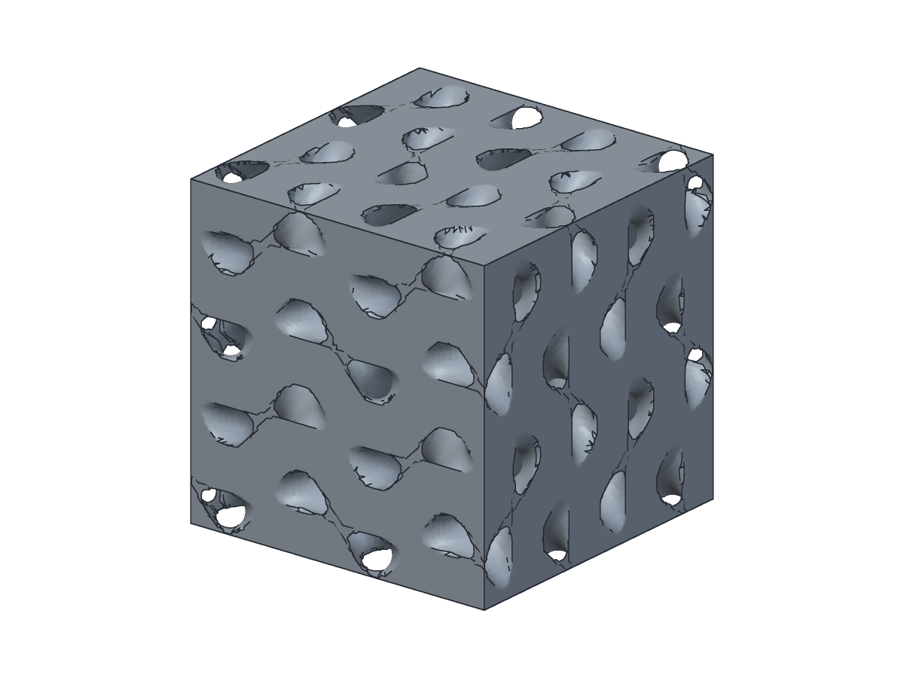
  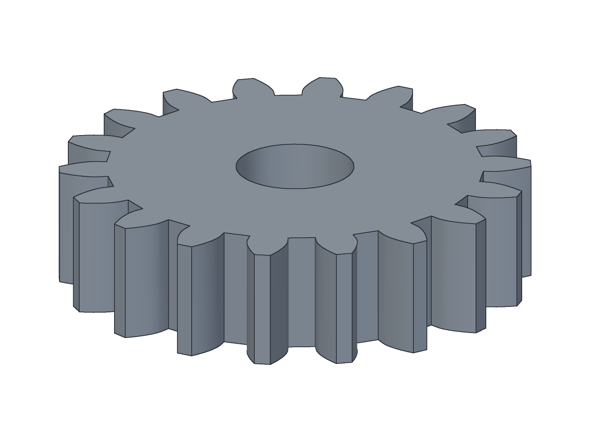
  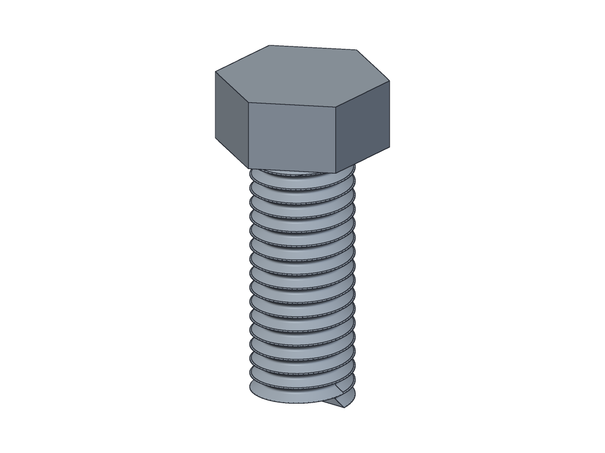
  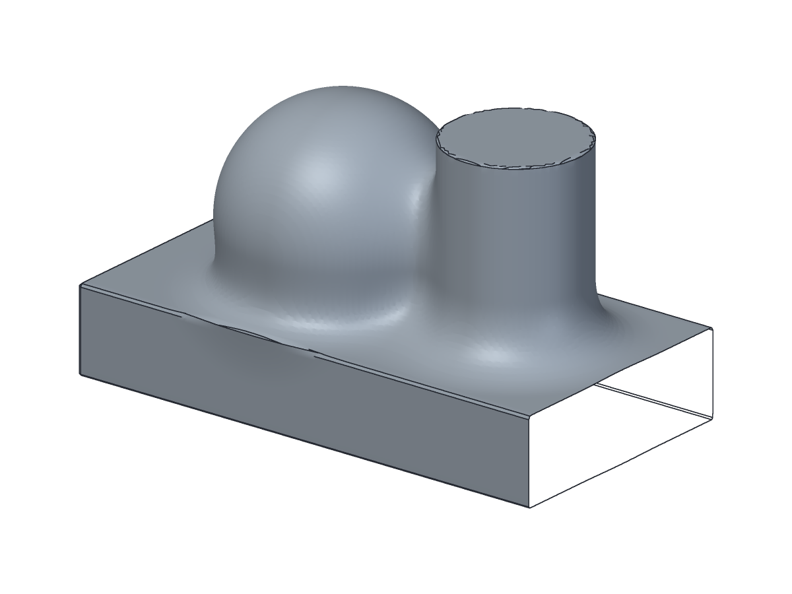
</p>
<p align="center">
  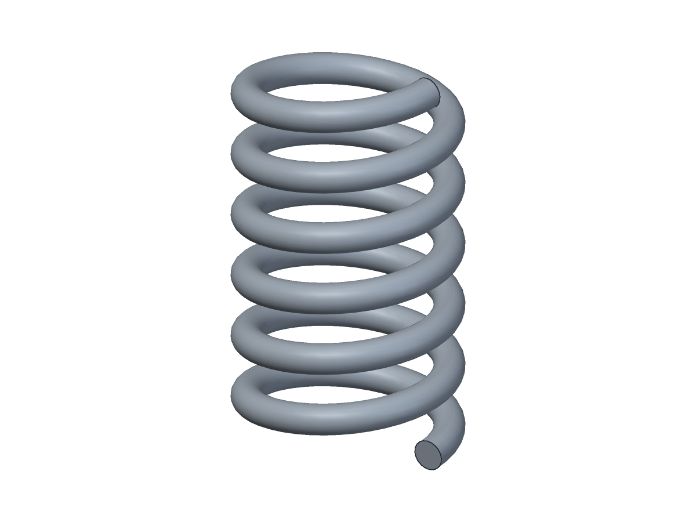
  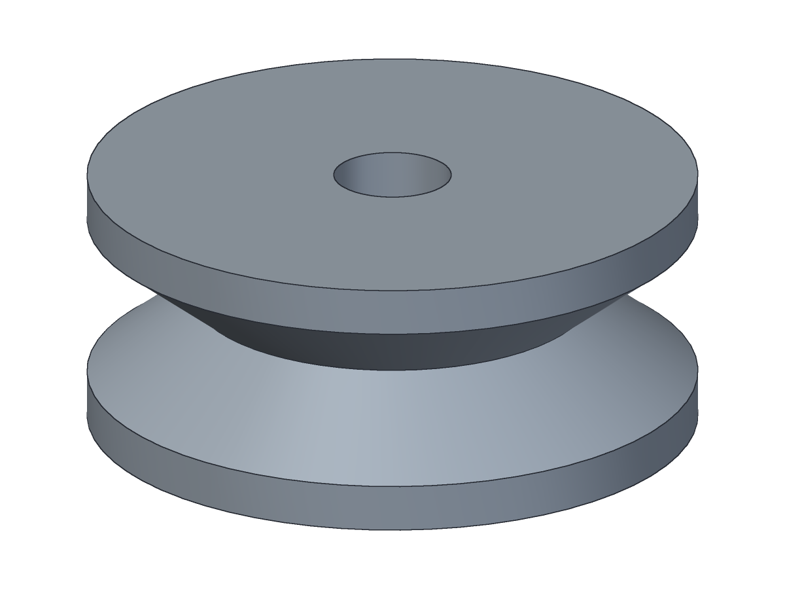
  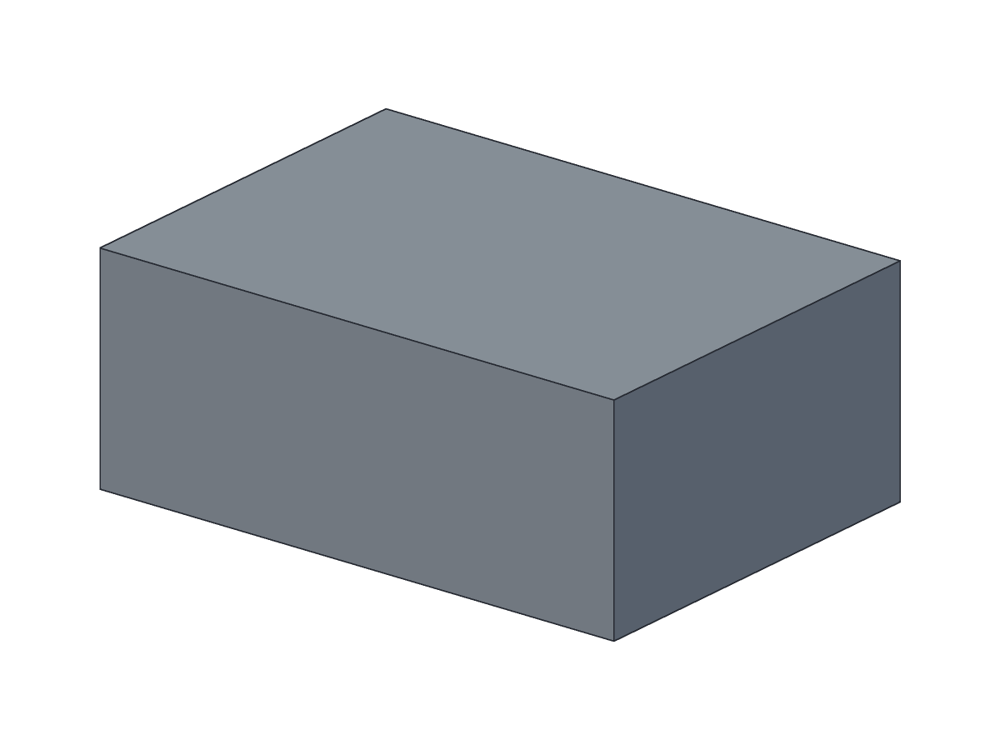
  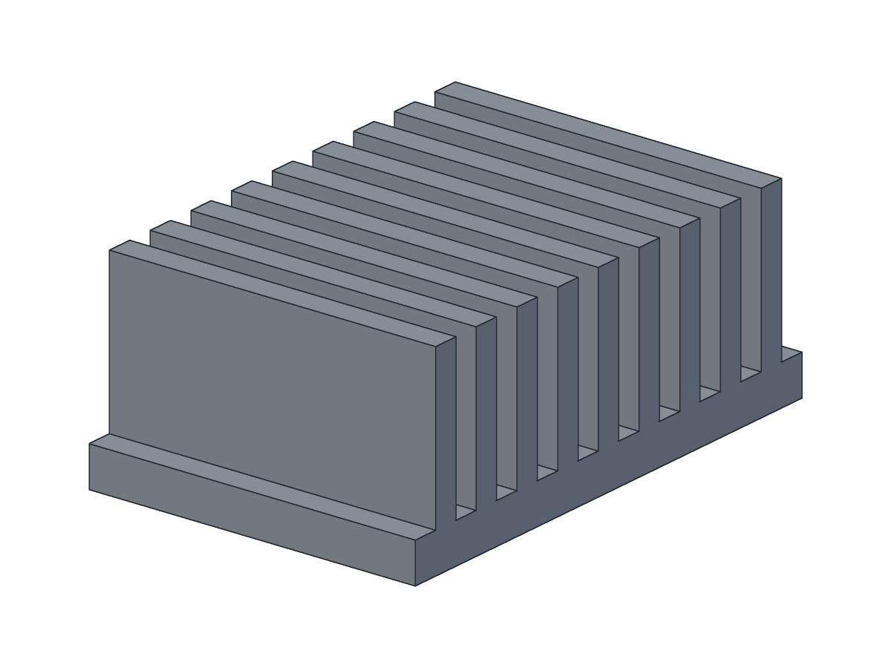
</p>
<p align="center">
  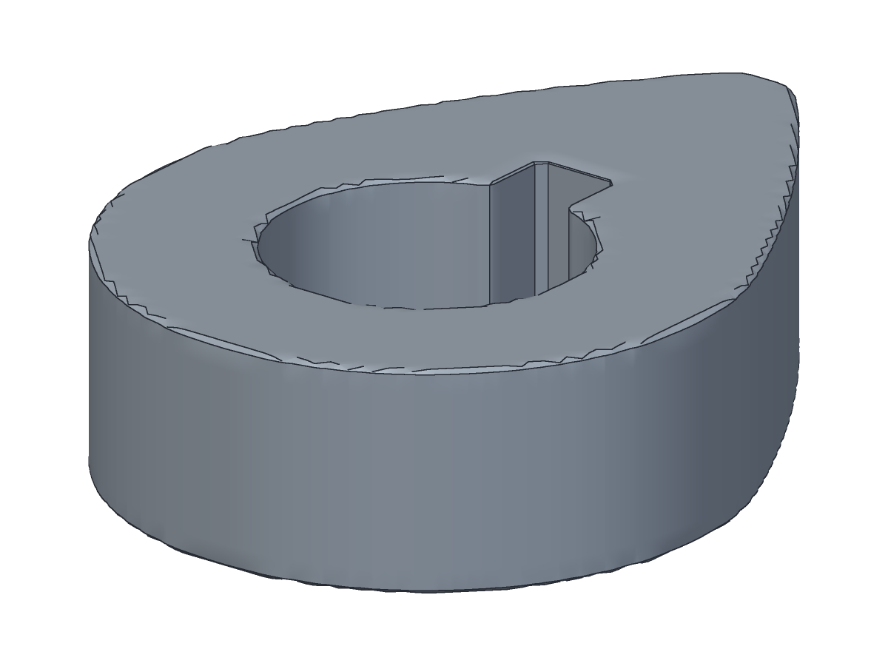
  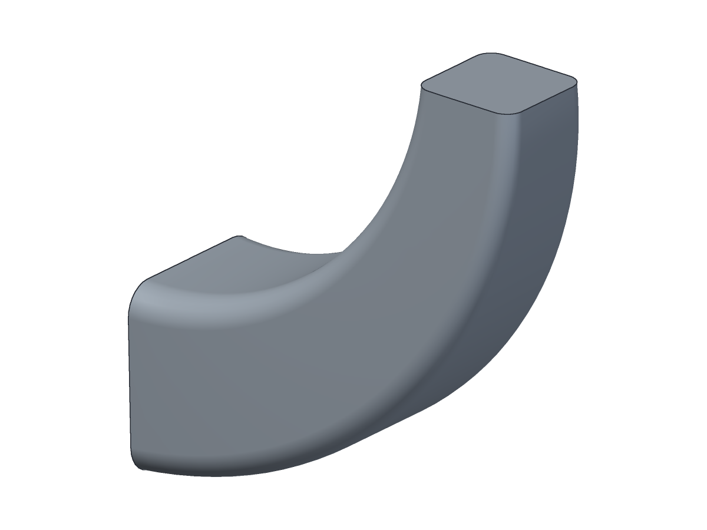
  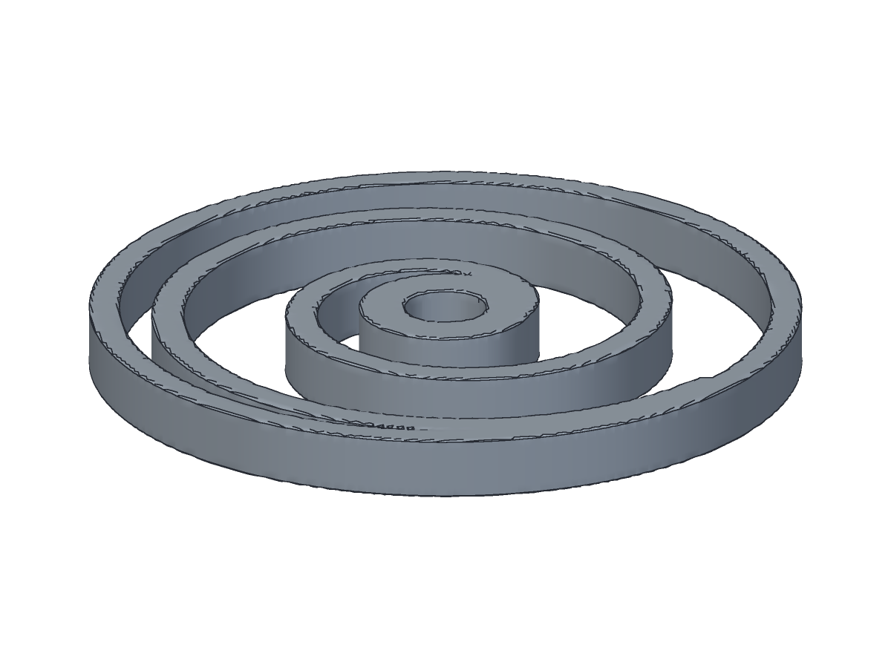
  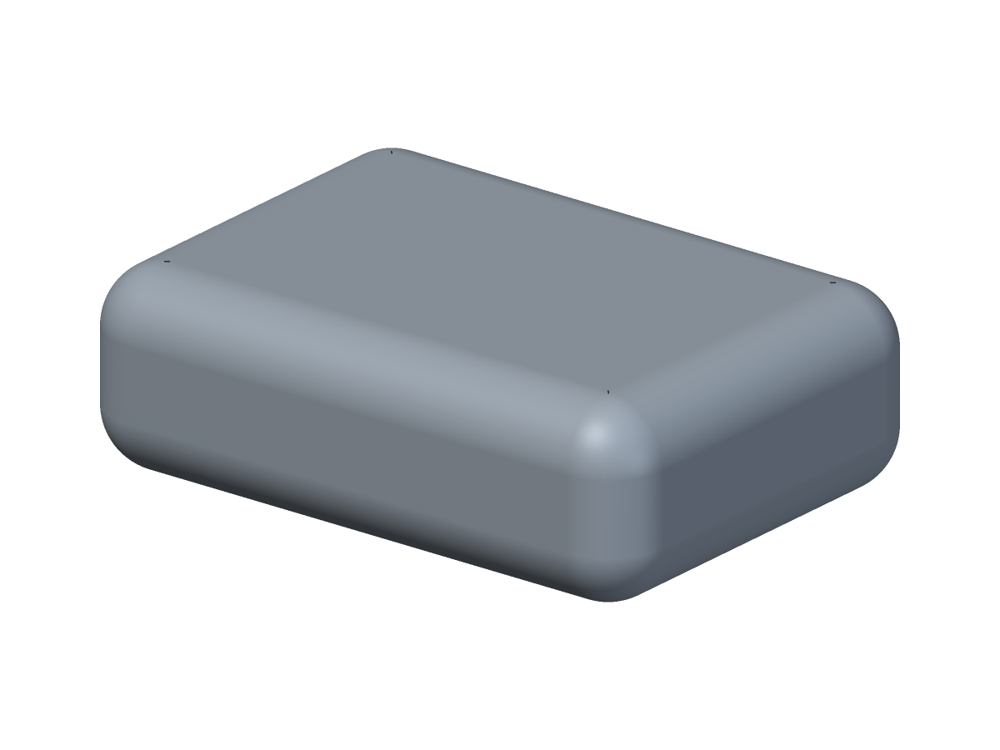
</p>

The gyroid and the smooth blend are worth pausing on: **no B-rep kernel can make
them.** They are signed distance fields, and they exist here because the geometry
layer was mined from the SDF literature rather than wrapped around a kernel.

The shelled enclosure is worth pausing on for a different reason. Its wall is
**inward**, which is what a shell should be, and it is correct because the render
builds on the OCCT path (via `cadquery`) whose shell was right from the start. These
gallery renders were not corrupted by any of the bugs recorded below.

## Independent voices, one op stream

The same typed op stream runs on roughly a dozen backends and integrations:
`cadquery`, `freecad` and `build123d` (all OCCT B-rep); `openscad` (CSG) and
`blender` (a mesh kernel); `frep` (kernel-free SDF); plus `manifold`, `truck`,
`rhino3dm`, `onshape`, `zoo` and `microcad`. More than a dozen file formats read and
write the same geometry (STL, STEP, STEP AP242, OBJ, PLY, glTF/GLB, AMF, 3MF, DXF,
SVG, 3DM, LDraw, KCL, xcsg, USD/USDZ, OFF, VRML, and more).

But a differential oracle is only as strong as the **independence** of the kernels
it cross-checks, and here honesty matters more than the headline count. A prior pass
called this "six independent engines". It is not. Of those six, `cadquery` and
`freecad` are both OCCT, and `openscad`, `blender` and `frep` all lower the same
kernel-neutral F-rep tree. So a bug living in OCCT, or in that shared lowering, is
invisible: every engine "agrees" while every engine is wrong. That is exactly how a
crop of op-field bugs rotted undetected until the backends were wired into a real
differential check.

The genuine independence is four voices, and the code says so:

| voice | backends | why it is independent |
|---|---|---|
| **OCCT B-rep** | `cadquery`, `freecad`, `build123d` | one kernel, three bindings; exact volumes |
| **Manifold** | `manifold` | a from-scratch mesh-boolean kernel, no OCCT, no F-rep tree |
| **truck** | `truck` | a from-scratch non-OCCT B-rep NURBS kernel, in Rust, driven out of process |
| **frep (SDF)** | `frep` (and `openscad`/`blender`, which lower it) | kernel-free signed distance fields |

`manifold` and `truck` were added for exactly this reason: to give the oracle a vote
that does not share a code path with OCCT or with the F-rep lowering. When they
agree with OCCT, the number is trusted for a reason. When they do not, the harness
says so instead of hiding it.

On a 40x24x8 plate with two 6 mm through-holes (analytic 7227.610658 mm3):

| backend | volume | error |
|---|---|---|
| `cadquery` (OCCT B-rep) | 7227.610658 | exact to 1e-12 |
| `freecad` (OCCT B-rep) | 7227.610658 | exact to 1e-12 |
| `openscad` (exact CSG) | matches closed-form | 6e-9 relative |
| `frep` (SDF, default grid) | 7179.781788 | 0.66% under |

The B-rep volume is exact because it is read off the kernel with `BRepGProp`, not
off a mesh. That matters for a bug recorded below: a STEP export and tessellation
problem touched the exported **artifact** and the oracle's error budget on the meshed
path, but it did **not** contaminate the B-rep volume measurements, which never go
through a mesh. The SDF error, by contrast, is grid resolution, and it converges: on
a four-hole plate it falls from 0.69% at the default grid to 0.11% at resolution 128
and 0.08% at 160. It is a knob, not a defect. But it is never zero, which is why a
real kernel remains one flag away.

## The finding

Reading the text-to-CAD literature and a large set of CAD repositories end to end
surfaced something the field has not reckoned with, and it is the reason this
repository is shaped the way it is.

**Published metrics that share a name do not share a definition.** Six
implementations of "chamfer distance", all from the literature, run on the *same two
point clouds*:

| metric | value | normalisation |
|---|---|---|
| `chamfer_unit_sphere` | 0.0250 | unit sphere |
| `chamfer_unit_cube` | 131.14 | unit cube |
| `chamfer_bbox_judged` | 0.0382 | centroid + max bbox extent, judge-gated |
| `chamfer_raw` | 0.2069 | none |
| `chamfer_scaled_step` | 0.1005 | STEP-scaled |
| `chamfer_orientation_aligned` | 0.1443 | pose-aligned |

Four orders of magnitude, from normalisation alone. Two papers reporting "chamfer
distance" are frequently not comparable, and neither paper says so.

The same holds for tokenisers. DeepCAD quantises to 256 levels with
round-half-even; SkexGen truncates to 6 bits, biasing every coordinate down half a
bin; HNC-CAD swaps continuous rotation for a 25-frame codebook that is neither the
24 proper rotations nor orthonormal; Vitruvion dequantises at the bin centre and is
the only one in the corpus with unbiased round-trip error.

**So the code refuses to blend them.** This is the load-bearing design decision:

```python
run_suite("deepcad", samples)    # selects chamfer_unit_sphere
run_suite("cadrille", samples)   # selects chamfer_unit_cube

Suite("mine", metrics=["chamfer_unit_sphere", "chamfer_bbox_judged"])
# RivalBlendError, raised at definition time. A blending suite cannot be built.
```

```bash
harnesscad ingest tokens.json --family skexgen
# error: sequence is tagged family 'deepcad' but the 'skexgen' dequantiser was
# requested; quantiser families are mutually incompatible and are never blended
```

A finding became an invariant. Rivals are selected by name, never averaged, and the
filenames carry the disagreement: `chamfer_unit_sphere.py` sits beside
`chamfer_bbox_judged.py` because the difference between them is the point.

## Measuring where the material is

The same insight drives the evaluation layer. Every published CAD benchmark grades
an **envelope**: how much material (volume, IoU), in what outline (Chamfer), of what
topology (watertight, manifold, genus). None of those can say *where* a feature
landed, and that is where the wrong parts hide.

- A volumetric IoU scores 0.973 on an 8 mm hole where the brief demanded 12 mm, and
  0.957 on a hole bored 20 mm from where it was asked for. Both pass.
- A box shelled open on the **wrong face** has exactly the same volume, the same
  bounding box, the same genus, and is equally watertight and manifold as the
  correct one. Every published geometric check calls it correct.

`eval/hardcorpus/` is built on this. It deliberately constructs the plausible wrong
answer a competent model would emit, and grades it **twice**: on the field's own
metrics in their strongest exact form (OCCT boolean IoU, symmetric Chamfer,
watertight, manifold), and on a **measured oracle** that classifies specific points
against the exact B-rep with `BRepClass3d_SolidClassifier`. The gap is the result:

```text
case          level field  oracle iou     defeats
dia_hole      L2    PASS   FAIL   0.973   IoU, Chamfer, watertight, manifold, invalidity
pos_hole      L2    PASS   FAIL   0.935   IoU, Chamfer, watertight, manifold, volume, genus
shell_face    L3    PASS   FAIL   0.506   watertight, manifold, volume, genus (the MUSE geometric stage)
```

Every reference answer in the corpus must build and pass its own oracle, asserted
per brief in the test suite, because a corpus whose own answer key does not pass its
grader is measuring the engine's bugs and billing the model. Ground truth comes from
closed-form arithmetic, never from this repository. **No model has been run against
it yet; the frontier run is pending.**

## The measured gate

`io/gate.py` is where the soundness stance is enforced on a built part. It exports
the geometry, measures it, and returns a verdict with an explicit error budget. It
is the shared instrument the oracle and the hard corpus read from, so "watertight",
"manifold", "genus" and "self-intersection" mean one thing across the whole
codebase rather than being re-derived, differently, in five places.

## Parts-Driven Development

Reading the spec-driven-development literature end to end (the SDD paper and
GitHub's spec-kit, plus MAS-Lab, traceSDD, TDAD and the Kitchen Loop) surfaced why
software spec-driven development stalls at *spec-anchored*: its validation is
fallible prose-testing, so a passing spec-test only proves the code matches the
spec, never that the spec is right. CAD is the exception. A part's acceptance
criteria are **measurable quantities of the artifact** (volume, genus, wall
thickness, mass, hole positions, assembly mobility), so the same discipline reaches
a rung software cannot: **parts-as-measured-source**, where you do not trust the
generator, you measure its output and refuse on mismatch.

`agents/pdd/` and `domain/spec/contract.py` build this as **Parts-Driven
Development (PDD)**, mapping the four spec-driven phases onto the harness. Specify
becomes a **Measured Geometric Contract**: predicates with tolerances, and a
`[NEEDS CLARIFICATION]` marker for any measurable the brief left unstated, because
a guessed millimetre is exactly the anti-pattern this repo deleted. Plan is the
typed op stream, Implement runs it, and Validate is the measured gate above plus
the differential oracle. A part is certified only when the gate did not refuse, the
independent kernels agree, every measured predicate passes, and every op is
attributed to a real geometry change. Three standing gates enforce it: an
orphan-provenance gate (every op must move real geometry, the traceSDD orphan-REQ
check applied to a solid), a verifier-fleet mutation score (inject known defects
and require the oracle kills them), and an op-by-backend-by-format coverage census
with a drift pause-gate. The design is in `audit/pdd_synthesis.md`, and every
verdict carries the same honest residual as the oracle: a PASS means the part
passes every measured predicate, not that it matches the designer's intent.

## Driving a real CAD GUI

`io/cua/` and `agents/cua/` are a computer-use system for CAD, built from a full
read of the computer-use literature, and it rests on two facts unique to this
domain.

- **CAD toolbars are pixel-stable.** A web page's DOM shifts every load; a CAD
  ribbon's icons are shipped assets at fixed positions. Template matching on the icon
  bitmap is a deterministic, no-VLM grounding path for the majority of actions. Where
  a scriptable console exists (FreeCAD, Blender), the agent types into it and the
  observation is text, not pixels.
- **CAD has a free exact correctness oracle.** Every other computer-use agent's
  hardest problem is verification. Here the harness drives the GUI, exports, and
  measures through `io/gate.py` and the differential oracle, so a whole trajectory is
  labelled for free. The success signal is measured geometry, not a model's opinion
  of a screenshot.

Environments are built for FreeCAD and Onshape, and for the desktop suites
SolidWorks, Fusion 360 and Inventor, each reading its result back through the
application's own mass-property API (COM or in-process) rather than a screenshot, so
success is a measured volume change and never a click that returned.

The limits are stated plainly in `audit/cua_synthesis.md`: the console tier only
exists for apps that ship one, Blender draws its own UI and must be driven through
`bpy` rather than the accessibility tree, and the oracle is many-to-one, so a
trajectory of verified clicks is verified clicks and not a proof that the part
matches intent.

## What the harness cannot yet promise

Soundness means the honest failures are documented, not hidden. Two are worth
stating here.

**A false instruction can still cost a right answer.** In a red-team pressure
experiment, the harness arm **lost** its first version by 8.3 points: eight net
regressions, zero wins. The cause was not the model. The fleet of verifiers was
handing a capable model a diagnostic that was false, and a typed diagnostic is an
**instruction** that gets obeyed even when it is wrong. Every one of those eight
losses was a correct answer edited into a wrong one on the strength of a heuristic
rule that happened to fire falsely. The fix is soundness tiering: only PROVEN (a
theorem) or MEASURED (an observed fact) diagnostics may instruct a model, and a mere
HEURISTIC may block a build but never rewrite an answer. That fix and the v2
apparatus are built. **The frontier re-run that would demonstrate it is pending.**

**The op vocabulary now reaches past the shared core, and what remains is named.**
`audit/cisp_completeness.md` recorded that the protocol covered the
sketch-extrude-feature-history B-rep core every backend shares. The three
lowest-risk closures it flagged (Primitive, Split, Thicken) and four sketch
entities (arc, ellipse, polygon, spline) have since been added and mapped
**implement-or-refuse across all thirteen backends**: a backend either lowers a new
op to its kernel or refuses it with a typed diagnostic that taints the measurement,
never accepting it as garbage. What is still open is the higher-risk vocabulary
(hull, minkowski, port-typed assembly mates), because naming those is a coordinated
schema change every backend's dispatch depends on, not a solo edit.

## The two public boards

Two benchmark surfaces are scaffolded in `eval/leaderboard/`. They rank reports a
future run produces; they run no model themselves.

- **CADSpot** (`eval/leaderboard/cadspot_board.py`) ranks CAD GUI grounding by the
  four surfaces a user clicks (toolbar, dialog, tree, viewport). The chrome is a
  CAD-flavoured re-run of what OS-Atlas did for Windows; the **viewport** is the
  contribution, because it cannot be scraped and no other grounding dataset has it.
  The board scores the viewport on the app's own picker where a live app adjudicated
  it, and on a labelled proxy otherwise.
- **Hard corpus** (`eval/leaderboard/hardcorpus_board.py`) ranks text-to-CAD
  submissions on **both** the weak metrics the field uses and the measured oracle,
  side by side. It ranks on the oracle and reports, for each submission, how many
  parts the field would have passed that the geometry does not.

## How it works

Geometry is a typed op stream rather than generated code, so it can be checked
before it is built. `HarnessSession` validates each op against a contract, runs a
fleet of verifiers over the plan while it is still cheap to change, and returns typed
diagnostics instead of exceptions. The stream is content-digested and event-sourced,
so a model can be replayed, diffed, edited, or ingested back from a mesh, a drawing,
or a token sequence.

```python
from harnesscad.core.loop import HarnessSession
from harnesscad.io.backends.frep import FRepBackend

session = HarnessSession(FRepBackend(), verify_level="full")
result  = session.apply_ops(ops)
result.ok, result.digest, result.diagnostics
```

Everything else hangs off registries that discover their modules from a static AST
index, so a capability that leaves the tree leaves the surface:

```bash
harnesscad spec        --brief "a 20x10x5 plate with a 3mm hole"  # brief -> checked spec
harnesscad ingest      tokens.json --family deepcad        # tokens -> editable ops
harnesscad reconstruct --from point_cloud --to primitives  # many routes
harnesscad program     --lang openscad --validate part.scad
harnesscad export      part.stl                            # stl glb amf obj step svg 3mf dxf ...
harnesscad bench       --suite deepcad --input runs.json
harnesscad report                                          # mass, pose, tolerance, DFM
harnesscad capabilities --tag sdf
```

## Where the code lives

```text
src/harnesscad/
  core/       the op spine: contract, loop, pipeline, digest, CLI
  domain/     geometry, numerics, reconstruction, CAD program analysis
  io/         formats, ingestion, backends, protocol surfaces, computer-use
  eval/       verifiers, benchmarks, oracles, leaderboards, quality analysis
  agents/     agent loop, LLM layer, generation, RAG, memory
  data/       dataset engine, generators, the training flywheel
tests/        mirrors src/ exactly
```

Modules are named for what they do, not for the paper they came from, with one
deliberate exception: where provenance *is* the meaning, it stays.
`reconstruction/tokens/` holds `deepcad_quantize.py` next to `skexgen_quantize.py`
because they disagree, and the disagreement is the finding.

## Status

Wiring the modules into real call paths found bugs in code that already existed and
already passed its own unit tests: an STL exporter that wrote binary and read it back
as UTF-8, a format advertising a codec it does not ship, a mesher producing
non-manifold output when a face landed on a sample plane, a metric adapter that
errored on every input it was ever given, and a "3D" contourer that only implements
the 2D case. None were reachable, so none were caught. This is the same discipline
that later caught backends leaking wrong volumes once the differential oracle was
wired up.

The modules that remain unwired are reported with reasons rather than given
fabricated call sites. Reinforcement-learning losses have no trainer here. Some
modules need a renderer or human annotators that do not exist. A block of benchmark
entries are dataset manifests and judge scaffolding, not metrics, and were never
going to fit a `score(pred, gold)` seam.

Known correctness questions are recorded rather than quietly resolved, in
[`docs/corpus/repo-ideas.md`](docs/corpus/repo-ideas.md) and the `audit/` notes.

Stdlib-only, deterministic: no wall clock, seeded randomness.

## Install

```bash
pip install -e .                 # core, no required dependencies
pip install -e ".[cadquery]"     # OCCT geometry backend
pip install -e ".[llm]"          # LLM planner
pip install -e ".[constraints]"  # SolveSpace sketch solver
pip install -e ".[cua]"          # drive a live CAD GUI (Windows accessibility tree)
```

Python >= 3.10. Provider keys are read from the environment and never stored.

Run one test module at a time; a monolithic `unittest discover` segfaults at OCCT
teardown:

```bash
python -m unittest tests.domain.geometry.sdf.test_primitives
```

## License and citation

MIT. HarnessCAD reproduces no single paper. Its domain layer is drawn from a large
corpus of text-to-CAD papers and CAD repositories, and each module's originating
work is attributed in the [corpus ledgers](docs/corpus/paper-ideas.md). Cite the
originating work for the capability you use, not this repository.
