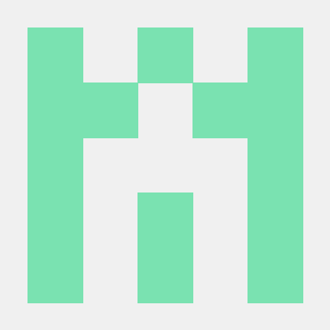
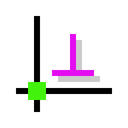

<div align="center">

# HarnessCAD

**A native agentic harness for engineering/mechanical text-to-CAD — the harness, not the model, is the product.**


<p>
  <a href="https://www.python.org"></a>
  &nbsp;&nbsp;&nbsp;&nbsp;
  <a href="https://github.com/CadQuery/cadquery"></a>
  &nbsp;&nbsp;&nbsp;&nbsp;
  <a href="https://dev.opencascade.org"></a>
  &nbsp;&nbsp;&nbsp;&nbsp;
  <a href="https://github.com/BerriAI/litellm"></a>
  &nbsp;&nbsp;&nbsp;&nbsp;
  <a href="https://github.com/567-labs/instructor"></a>
  &nbsp;&nbsp;&nbsp;&nbsp;
  <a href="https://github.com/KmolYuan/solvespace"></a>
</p>

</div>

HarnessCAD turns a natural-language design brief into a precise, *verified* sequence of
parametric CAD operations. It is not a model and it is not a plugin: it is the
**harness** around a frontier model — the loop, the typed op language, the plural
geometry verifier, the event-sourced op history, and the kernel seam — that makes
text-to-CAD reliable enough to trust. The core spine is pure Python standard library
(no required dependencies); a real OpenCASCADE geometry kernel and a provider-agnostic
LLM layer are opt-in extras.

## About

The thesis is simple and load-bearing: **the harness, not the model, is the product.**
Frontier models can already emit CAD code; what they cannot do on their own is know
whether the geometry they emitted is *right*. Structured output guarantees a tool call
*parses* — it never guarantees the solid is manifold, the sketch is fully constrained,
or the boolean did not null the body. The real safety net is always **external
execution plus geometry checks**, never model self-confidence.

CAD is the rare, valuable setting where that safety net can be made rigorous: it is a
**verifiable-reward domain**. Geometry compiles or it does not; constraints solve or
they do not; dimensions, mass, and interference either match the spec or they do not.
The deterministic verifier is simultaneously the reward, the eval, and the ceiling —
so HarnessCAD is built **verifier-first**, around a verifier that is *plural* (several
independent checks whose diagnostics feed back into the loop) rather than a single
end-gate.

The winning loop is already proven in coding agents. Aider's `edit -> compile -> run
tests -> commit` maps one-to-one onto CAD:

| Coding agent (solved) | HarnessCAD |
|---|---|
| Edit a source file | **Emit a typed CISP op** (sketch, constrain, extrude, fillet, boolean) |
| Compile | **Kernel regeneration** of the op stream |
| Compile error | Regen failure (empty profile, failed boolean, over-constrained sketch) |
| Run tests | **Geometry checks** (sketch DOF, manifold / watertight, solid presence) |
| Observe the traceback | Read diagnostics + measurements |
| Git commit on success | **Checkpoint the op-DAG** (deterministic replay + rollback) |

HarnessCAD is **frontier-model-native** (bring any model through the LiteLLM seam;
train nothing) and **kernel-agnostic**: everything above the `GeometryBackend` seam is
pure logic, so the dependency-free stub, the CadQuery/OCCT kernel, and a future
Rust-native kernel are interchangeable behind one interface.

## How it works

Each op the agent emits goes through the same transactional cycle. An op the backend
rejects (bad reference, non-positive radius, kernel exception) never mutates
state — **block-and-correct**. An op that applies but fails a verifier is **rolled
back** to the last good state. Only an accepted *and* verified op is checkpointed:

```
brief ──▶ planner ──▶ [op, op, op] ──▶ HarnessSession.apply_ops
                ▲                              │
                │                     ┌────────┴─────────┐
                │                     ▼                  ▼   (per op)
                │              backend.apply        block-and-correct
                │                     │             (reject, no mutate)
                │                     ▼
                │              backend.regenerate
                │                     ▼
                │              verify (plural)  ──ERROR──▶ rollback last op
                │                     │ ok
                │                     ▼
                │              checkpoint op-DAG
                │                     │
                └──── diagnostics ◀───┘  (re-plan until verified or max_iters)
```

The op-DAG is append-only and content-hashed: each node chains its parent's hash with
the canonical JSON of its op, so an identical op sequence always produces an identical
`digest`. That single invariant gives checkpoint, rollback, and deterministic replay
for free.

## Architecture

Every layer below is kernel-agnostic and LLM-agnostic until the seam that names
otherwise. The from-scratch core is the middle band.

```
┌──────────────────────────────────────────────────────────────────┐
│  Cost routing    routing.RoutingLLM — classify -> cheapest capable │  wraps the LLM seam
│                  model -> fallback chain · running cost/usage tally │
├──────────────────────────────────────────────────────────────────┤
│  LLM seam        llm/  — Message · ToolSpec · CompletionResult    │  provider-neutral
│                  LiteLLMClient (~100 providers)  ·  Instructor     │
│  Constrained     grammar.py — op JSON Schema + GBNF/EBNF grammar   │  derived from the
│  decoding        + GrammarConstraint post-hoc validator            │  op registry
├──────────────────────────────────────────────────────────────────┤
│  Multi-agent     agents/ — Designer·Modeler·Verifier·DFMCritic·   │  supervisor loop
│                  RedTeam·Reviewer + Supervisor + AsyncOverseer      │  + halt authority
│                  a2a/ — AgentCard · A2AMessage · Task lifecycle     │  inter-agent bus
├──────────────────────────────────────────────────────────────────┤
│  Reliability     strategies/ — best_of_n (draw N, verifier picks)  │  spend compute to
│                  · ReflexionLoop (act -> reflect -> retry)          │  raise success
│                  guardrails.py — GuardrailGate (before-tool) ·      │  block bad ops
│                  ErrorRecovery ladder · loopdetect.LoopDetector     │  before they apply
├──────────────────────────────────────────────────────────────────┤
│  Build pipeline  pipeline.build — brief -> planner -> session ->  │  one-call end-to-end
│                  verified geometry -> STEP  ·  cli.py build        │
├──────────────────────────────────────────────────────────────────┤
│  Agent           agent/  — Planner (NL brief -> validated ops)    │
│                  runner.run (plan -> apply -> observe -> replan)   │
├──────────────────────────────────────────────────────────────────┤
│  Grounding       context/ — ContextManager (token budget) +        │  skills grow only when
│                  StagingArea · rag/ — hybrid BM25+vector retriever  │  their geometry verifies
│                  memory/ — MemoryStore + Voyager-style SkillLibrary │
├──────────────────────────────────────────────────────────────────┤
│  Harness loop    loop.HarnessSession                              │  ← the from-scratch core
│                  applyOps -> regen -> verify -> checkpoint         │
│                  block-and-correct · transactional rollback        │
├──────────────────────────────────────────────────────────────────┤
│  Plural verifier verify.py (DOF · solid-presence · BRep validity) │  diagnostics feed
│                  constraints.py (solver) · contract.ContractCheck  │  back into the loop
│                  checks_dfm.DFMCheck · checks_vision.VLMJudgeCheck  │
├──────────────────────────────────────────────────────────────────┤
│  Ops-DAG         state/opdag.py  — append-only, content-hashed    │  "git for CAD"
│                  checkpoint · rollback · deterministic replay      │
├──────────────────────────────────────────────────────────────────┤
│  GeometryBackend backends/base.py  (swappable kernel seam)        │
│    StubBackend (stdlib) · CadQueryBackend (OCCT) · future Rust    │
├──────────────────────────────────────────────────────────────────┤
│  Surfaces        cisp/ (typed ops + protocol) · server.py (stdio) │  LSP-inspired
│                  mcp/ (ToolCatalog + CADGymEnv) · ui/ (SSE +       │  JSON methods
│                  three-tier approval) · render.py (multi-view)     │
├──────────────────────────────────────────────────────────────────┤
│  Observability   observe.py (spans · KPI metrics · failure         │  cross-cutting
│                  taxonomy · replay) · trace.py (event stream)       │
├──────────────────────────────────────────────────────────────────┤
│  Data engine     dataengine/ (Trajectory + GRPO/DPO/STaR export)  │  offline flywheel
│                  datagen/ (synthetic generators + solver-in-loop)  │
└──────────────────────────────────────────────────────────────────┘
```

`CISP` is the CAD Interaction / Sketch Protocol — an LSP-inspired vocabulary
(`initialize` / `applyOps` / `query` / `verify` / `export`) over line-delimited JSON,
so the same harness drops into an MCP server, a subprocess, or a stdio pipe unchanged.

**The plural verifier.** The default set runs three independent checks —
`SketchConstraintCheck` (DOF), `SolidPresenceCheck`, and the real `BRepValidityCheck`
(OCCT topology / manifold / watertight) — where `constraints.py` supplies a genuine
DOF model (`ConstraintGraph` rank analysis plus an optional SolveSpace-backed real 2D
solver) and `contract.ContractCheck` adds an opt-in acceptance spec (required dims +
tolerances, volume/mass, feature counts, manifold/validity, named predicates). Two
opt-in critics broaden it beyond geometry: `checks_dfm.DFMCheck` is a Design-for-
Manufacturing critic (aspect-ratio, thin/small-part) that only ever emits
WARNING/INFO, and `checks_vision.VLMJudgeCheck` is the VLM-as-judge for the subjective
slice (design intent, cleanliness), advisory-only with a 0..1 score. Both are additive
by design — neither can flip a passing report to failing.

**Grounding.** `context/` manages the finite token window explicitly — `ContextManager`
budgets `C >= system + memory + tools + history + reserved`, guards overflow pre-flight,
and assembles a prefix-cache-friendly prompt, while `StagingArea` is the file-based
per-task "anti-RAG". `rag/` is a dependency-free hybrid retriever — structure-aware
chunking feeds a BM25 lexical index and an embedding-free hashed-vector index fused by
reciprocal-rank fusion. `memory/` holds the four memory types and a Voyager-style
`SkillLibrary` that admits a skill only when its expanded ops verify.

**Reliability.** `strategies/best_of_n` draws N seeded candidate plans through fresh
sessions and lets the deterministic verifier pick the winner; `strategies/reflexion`
runs a Read-Act-Reflect-Write loop that writes failure insights to semantic memory and
retries. Before any op applies, `guardrails.GuardrailGate` (the `before_tool_callback`
hard gate) rejects obviously invalid ops without mutating kernel state,
`loopdetect.LoopDetector` catches an agent retrying the identical op, and
`guardrails.ErrorRecovery` enumerates the detect -> handle -> recover ladder.

**Multi-agent + surfaces.** `agents/` wraps the single-agent baseline with six role
personas (Designer, Modeler, Verifier, DFMCritic, RedTeam, Reviewer), a `Supervisor`
that chains them and feeds diagnostics back each round, and an `AsyncOverseer` with
halt authority; `a2a/` is the inter-agent wire format (`AgentCard`, `A2AMessage`, and a
guarded `Task` lifecycle with SSE-style events). `mcp/` exposes the environment as an
MCP-style server (`ToolCatalog` — one tool per op plus `measure`/`query`/`verify`/
`export`/`render` — with behavioural `annotations`) and a `CADGymEnv` Gym environment
(`reset`/`step` -> obs, verifier-derived reward, done, info). `ui/` is the outward SSE
event contract (`UIEvent`/`EventStream`) plus a three-tier approval gate (AUTO /
NOTIFY / REQUIRE) with dry-run previews. `render.py` renders the current solid to
multi-view SVG/PNG bytes as the observation half of a render -> judge loop.

**Cross-cutting.** `routing.RoutingLLM` is a drop-in `LLM` that classifies each request
and routes it to the cheapest capable model with a fallback chain and a running cost
tally. `grammar.py` derives an op JSON Schema and a GBNF/EBNF grammar from the op
registry (so they cannot drift) plus a stdlib post-hoc `GrammarConstraint` validator.
`observe.py` computes the blueprint's KPIs from a run trajectory with confidence
intervals, classifies failures into a taxonomy, and replays runs. And the offline
**data engine** folds each run into a canonical `Trajectory` and exports GRPO / DPO /
STaR training rows (`dataengine/`), while `datagen/` bootstraps cold-start data with
seeded synthetic generators kept honest by solver-in-the-loop verification.

Finally, **`bench/`** is CADBench-Verified — a SWE-bench-style eval that runs tasks
through the same spine and scores editability, program execution, B-rep validity, and
dimension match per difficulty.

## Quickstart

The core spine has **no dependencies** — clone and run. Python 3.10+.

```sh
git clone <repo> && cd harnesscad
python cli.py demo                             # built-in constrained-plate -> extrude sample
python -m unittest discover -s tests -t . -v   # the full suite (520 tests)
```

### Drive a session directly

Build a plate and extrude it on the dependency-free stub backend. The stub is not
geometry — it models the op *semantics* (DOF tracking, references, digests,
deterministic replay) so the whole harness spine runs with nothing installed.

```python
from backends.stub import StubBackend
from loop import HarnessSession
from cisp.ops import NewSketch, AddRectangle, Constrain, Extrude

session = HarnessSession(StubBackend())
result = session.apply_ops([
    NewSketch(plane="XY"),
    AddRectangle(sketch="sk1", x=0.0, y=0.0, w=20.0, h=10.0),
    Constrain(kind="distance", a="e1", value=20.0),
    Constrain(kind="distance", a="e1", value=10.0),
    Extrude(sketch="sk1", distance=5.0),
])

print("ok:", result.ok)            # -> ok: True
print("applied:", result.applied)  # -> applied: 5
print("digest:", result.digest)    # deterministic content hash of the model
print("summary:", session.summary())
# -> {'sketch_count': 1, 'entity_count': 1, 'feature_count': 1, 'solid_present': True}
```

Ids are assigned deterministically: sketches are `sk1, sk2, ...`, sketch entities are
`e1, e2, ...`, features are `f1, f2, ...`. `apply_ops` returns an `ApplyOpsResult`
(`ok`, `applied`, `digest`, `diagnostics`, `rejected`).

### Close the agent loop

Give the planner any `LLM` (a mock here; a live model in practice) and let the runner
plan, apply, observe diagnostics, and re-plan until the model verifies:

```python
from llm.base import LLM, CompletionResult
from agent.planner import Planner
from agent.runner import run
from loop import HarnessSession
from backends.stub import StubBackend

class MockLLM(LLM):
    def complete(self, messages, tools=None, response_schema=None, **o):
        return CompletionResult(text='''[
          {"op": "new_sketch", "plane": "XY"},
          {"op": "add_circle", "sketch": "sk1", "cx": 0, "cy": 0, "r": 8},
          {"op": "extrude", "sketch": "sk1", "distance": 4}
        ]''')
    def stream(self, *a, **k):
        yield ""

session = HarnessSession(StubBackend())
result = run(session, Planner(MockLLM()), "a round boss 16mm across, 4mm tall")
print("ok:", result.ok, "applied:", result.applied)   # -> ok: True applied: 3
```

To use a real model, swap in the LiteLLM backend (`pip install -e .[llm]`):

```python
from llm.litellm_backend import LiteLLMClient
planner = Planner(LiteLLMClient(model="gpt-4o-mini", temperature=0.0))
```

### Build from a brief

`pipeline.build` is the single end-to-end entry point — brief -> LLM planner ->
`HarnessSession` -> verified geometry -> STEP. Drive it from the CLI:

```sh
export ANTHROPIC_API_KEY=...                    # or OPENAI_API_KEY
python cli.py build "an M6 clearance plate, 40x20x5mm" --out part.step
python cli.py build "a round boss 16mm across, 4mm tall" --backend stub
```

`build` needs a provider key in the environment (`ANTHROPIC_API_KEY` or
`OPENAI_API_KEY`); with neither set it exits with a clear, actionable error. The
`--backend cadquery` default **falls back to the stub** when CadQuery is not
installed (reported in a `note:` line), so the command always runs.

In Python, inject any `LLM` (a mock here so the snippet runs with nothing installed;
a live model in practice) and get a plain result dict back:

```python
from pipeline import build
from llm.base import LLM, CompletionResult

class MockLLM(LLM):
    def complete(self, messages, tools=None, response_schema=None, **o):
        return CompletionResult(text='''[
          {"op": "new_sketch", "plane": "XY"},
          {"op": "add_circle", "sketch": "sk1", "cx": 0, "cy": 0, "r": 8},
          {"op": "extrude", "sketch": "sk1", "distance": 4}
        ]''')
    def stream(self, *a, **k):
        yield ""

result = build("a round boss 16mm across, 4mm tall", llm=MockLLM(), backend="stub")
print("ok:", result["ok"], "applied:", result["applied"], "backend:", result["backend"])
# -> ok: True applied: 3 backend: stub
```

Omit `llm=` and `build` constructs a lazy `LiteLLMClient` (built only on the first
model call) using the environment key. The result dict carries `ok`, `applied`,
`digest`, `diagnostics`, `summary`, the resolved `backend`, and the exported `step`
text when `ok`.

### The CLI

```sh
python cli.py demo                              # constrained-plate sample (stub)
python cli.py apply examples/ops_plate.json     # run a JSON array of ops
python cli.py apply examples/ops_plate.json --backend cadquery   # real OCCT solid
python cli.py build "<brief>" --out part.step   # brief -> verified geometry (needs API key)
```

`cli.py apply` and `cli.py build` exit non-zero when the resulting model is not `ok`,
so they compose in scripts and CI (`python cli.py apply plan.json && next-step`).

### The CISP server

The harness also speaks CISP over stdio — one JSON request per line, one response per
line — for MCP / subprocess integration:

```python
from server import CISPServer

server = CISPServer(backend="stub")   # or "cadquery"
server.handle({"id": 1, "method": "initialize"})
server.handle({"id": 2, "method": "applyOps", "params": {"ops": [
    {"op": "new_sketch", "plane": "XY"},
    {"op": "add_circle", "sketch": "sk1", "cx": 0, "cy": 0, "r": 5},
    {"op": "extrude", "sketch": "sk1", "distance": 3},
]}})
# python server.py --backend stub        # or run it as a stdio loop
```

## The CISP op set (v0)

These are the *mutating* ops the agent emits; `measure` and `export` are queries handled
by the backend, not the op log. Sketch and constraint ops come first by design — the
wedge is sketch/constraint/layout assist, not one-shot solids. Each op is a frozen,
hashable dataclass with a stable tag, which is what makes the op stream deterministic.

| Op tag | Parameters | What it does |
|--------|------------|--------------|
| `new_sketch` | `plane` (`"XY"` / `"YZ"` / `"XZ"`) | Start a sketch on a datum plane |
| `add_point` | `sketch, x, y` | Add a point (2 DOF) |
| `add_line` | `sketch, x1, y1, x2, y2` | Add a line segment (4 DOF) |
| `add_circle` | `sketch, cx, cy, r` | Add a circle (3 DOF); `r > 0` |
| `add_rectangle` | `sketch, x, y, w, h` | Add a rectangle profile (4 DOF); `w, h > 0` |
| `constrain` | `kind, a, b?, value?` | Apply a geometric/dimensional constraint, reducing sketch DOF |
| `extrude` | `sketch, distance` | Extrude a closed profile into a solid; `distance != 0` |
| `fillet` | `edges, radius` | Round edges of the current solid; `radius > 0` |
| `boolean` | `kind` (`union` / `cut` / `intersect`), `target, tool` | Combine two solids |

Constraint kinds and the DOF each removes: `coincident` (2), `horizontal`, `vertical`,
`parallel`, `perpendicular`, `distance`, `radius`, `equal` (1 each). Dimensional
constraints (`distance`, `radius`) require a numeric `value`. A sketch that reaches
0 remaining DOF is fully constrained; a negative DOF is over-constrained (an ERROR that
gets rolled back), a positive DOF is under-constrained (a warning).

## Dependencies / tech stack

The **core spine is standard-library-only** — there is nothing to install to run the
stub backend, the loop, the verifier, the op-DAG, the CLI, or the CISP server. Real
geometry and live models are **opt-in extras**, imported lazily so the package loads
even when they are absent. Install what you need:

```sh
pip install -e .                        # core only (stdlib)
pip install -e .[cadquery]              # + real OCCT geometry backend
pip install -e .[llm]                   # + provider-agnostic model access
pip install -e .[constraints]           # + real 2D constraint solver (SolveSpace)
pip install -e .[cadquery,llm,constraints]   # everything
```

| | Dependency | Extra | How it's resolved / notes |
|:---:|------------|-------|---------------------------|
|  | [Python](https://www.python.org) 3.10+ | core | The whole spine is stdlib-only — zero required runtime dependencies |
|  | [CadQuery](https://github.com/CadQuery/cadquery) | `cadquery` | The real-geometry `GeometryBackend`; imported lazily, so the module loads without it |
|  | [OpenCASCADE](https://dev.opencascade.org) (OCCT) | `cadquery` | The B-rep kernel under CadQuery (via `cadquery-ocp`); powers real solids, validity checks, and STEP/STL export |
|  | [LiteLLM](https://github.com/BerriAI/litellm) | `llm` | One call shape across ~100 providers behind the vendor-neutral `LLM` seam; lazy import |
|  | [Instructor](https://github.com/567-labs/instructor) | `llm` | Optional structured-output coaxing; the harness falls back to plain JSON + `parse_op` when absent |
|  | [python-solvespace](https://github.com/KmolYuan/solvespace) | `constraints` | Real 2D sketch constraint solver (SolveSpace) behind `constraints.SolveSpaceSketch`; imported lazily. The stdlib `ConstraintGraph` rank-based DOF analysis needs nothing installed |

The kernel is deliberately behind a seam (`backends/base.py`): the same op stream runs
on the stub, on CadQuery/OCCT, or on a future Rust-native kernel (Fornjot / Truck /
Cadmium) with no change above the backend.

## Project structure

```
harnesscad/
├── cli.py                  # CLI: `demo`, `apply <ops.json>`, `build "<brief>"` (--backend stub|cadquery)
├── pipeline.py             # build() — brief -> planner -> session -> verified geometry -> STEP
├── server.py               # CISPServer: initialize/applyOps/query/verify/export over stdio
├── loop.py                 # HarnessSession — the applyOps->regen->verify->checkpoint spine
├── verify.py               # plural verifier: SketchConstraintCheck, SolidPresenceCheck, BRepValidity
├── checks_geometry.py      # BRepValidityCheck — real OCCT topology check (manifold/watertight)
├── checks_dfm.py           # DFMCheck — opt-in Design-for-Manufacturing critic (WARNING/INFO only)
├── checks_vision.py        # VLMJudgeCheck — VLM-as-judge for the subjective slice (advisory 0..1 score)
├── constraints.py          # 2D DOF: ConstraintGraph (rank analysis) + SolveSpaceSketch (real solver)
├── contract.py             # Contract acceptance spec + ContractCheck verifier (dims/mass/topology)
├── guardrails.py           # GuardrailGate (before-tool hard gate) + ErrorRecovery ladder
├── loopdetect.py           # LoopDetector — pre-apply sliding-window oscillation detector
├── routing.py              # RoutingLLM — classify -> cheapest capable model -> fallback + cost tally
├── grammar.py              # op JSON Schema + GBNF/EBNF grammar + GrammarConstraint (from op registry)
├── render.py               # multi-view render of the current solid to SVG/PNG bytes
├── observe.py              # observability: spans, KPI metrics + CIs, failure taxonomy, run replay
├── trace.py                # typed event stream (Null/InMemory/Jsonl tracers)
├── cisp/
│   ├── ops.py              #   the v0 CISP op set (frozen dataclasses) + parse/canonical JSON
│   └── protocol.py         #   ApplyOpsResult — the shape the agent sees back
├── state/
│   └── opdag.py            #   ops-DAG: append-only, content-hashed history ("git for CAD")
├── backends/
│   ├── base.py             #   GeometryBackend protocol (the swappable kernel seam)
│   ├── stub.py             #   StubBackend — dependency-free op semantics
│   └── cadquery_backend.py #   CadQueryBackend — real OCCT B-rep solids
├── llm/
│   ├── base.py             #   the provider seam: Message, ToolSpec, CompletionResult, LLM
│   ├── litellm_backend.py  #   LiteLLMClient — ~100 providers behind the seam
│   └── structured.py       #   response -> validated ops (with re-promptable error strings)
├── agent/
│   ├── system_prompt.py    #   role + op vocabulary (generated from cisp.ops, never drifts)
│   ├── planner.py          #   Planner — NL brief -> validated CISP ops
│   └── runner.py           #   plan -> apply -> observe -> replan correction loop
├── memory/
│   ├── store.py            #   MemoryStore — working/episodic/semantic/procedural memory
│   └── skills.py           #   SkillLibrary — Voyager-style, execution-verified skill templates
├── context/
│   ├── manager.py          #   ContextManager — token-window budget + overflow-guarded assembly
│   └── staging.py          #   StagingArea — file-based per-task task-context/ ("anti-RAG")
├── rag/
│   ├── chunk.py            #   structure-aware Markdown chunking (fenced code kept atomic)
│   ├── index.py            #   BM25Index + embedding-free HashedVectorIndex
│   └── retriever.py        #   HybridRetriever — RRF/weighted fusion + build_from_docs()
├── strategies/
│   ├── best_of_n.py        #   best_of_n — draw N seeded plans, verifier picks the winner
│   └── reflexion.py        #   ReflexionLoop — Read-Act-Reflect-Write, learns within a run
├── agents/
│   ├── roles.py            #   Designer/Modeler/Verifier/DFMCritic/RedTeam/Reviewer personas
│   ├── supervisor.py       #   Supervisor — chains the roles, feeds diagnostics back each round
│   └── overseer.py         #   AsyncOverseer — event-stream monitor with halt authority
├── a2a/
│   ├── messages.py         #   AgentCard, A2AMessage, Part — inter-agent wire vocabulary
│   └── task.py             #   Task lifecycle state machine + TaskStore (SSE-style events)
├── ui/
│   ├── events.py           #   UIEvent / EventStream — typed SSE wire protocol (+ parsers)
│   └── approval.py         #   ApprovalGate — three-tier AUTO/NOTIFY/REQUIRE + dry-run preview
├── mcp/
│   ├── tools.py            #   ToolCatalog — one tool per op + to_mcp() schema, verifier reward
│   ├── annotations.py      #   MCP behavioural hints (readOnly/destructive) -> approval tier
│   └── gym.py              #   CADGymEnv — reset/step(obs, reward, done, info) RL environment
├── dataengine/
│   ├── trajectory.py       #   Trajectory — canonical training record (steps + dense rewards)
│   └── export.py           #   to_grpo / to_dpo / to_star + flywheel_metrics
├── datagen/
│   ├── generators.py       #   seeded synthetic (brief, ops, params) generators
│   └── pipeline.py         #   solver-in-the-loop: keep only parts that verifiably build
├── bench/
│   ├── task.py             #   CADBench-Verified Task schema (spec + reference ops + acceptance)
│   ├── runner.py           #   run_task / run_suite over the HarnessSession spine
│   └── metrics.py          #   editability, program-execution, B-rep validity, dimension match
├── examples/
│   ├── ops_plate.json      #   a runnable op array (constrained plate -> extrude)
│   └── bench_tasks/        #   easy/medium/hard CADBench-Verified task files
├── tests/                  # 520 unittest tests across every module
├── HARNESS_BLUEPRINT.md    # the founding design doc / north star
└── pyproject.toml          # stdlib core; [cadquery], [llm], [constraints] optional extras
```

Research and reference material lives under a gitignored `resources/` directory and is
never committed — it is not part of the product.

### Module map

The same ~35 modules grouped by blueprint layer, for navigation:

- **Core spine** — `loop.py`, `state/opdag.py`, `cisp/`, `backends/`
- **Plural verifier** — `verify.py`, `checks_geometry.py`, `constraints.py`, `contract.py`, `checks_dfm.py`, `checks_vision.py`
- **Agent + pipeline** — `agent/`, `pipeline.py`, `cli.py`
- **Grounding** — `context/`, `rag/`, `memory/`
- **Reliability** — `strategies/`, `guardrails.py`, `loopdetect.py`
- **Multi-agent** — `agents/`, `a2a/`
- **LLM + decoding** — `llm/`, `routing.py`, `grammar.py`
- **Surfaces** — `server.py`, `mcp/`, `ui/`, `render.py`
- **Observability** — `observe.py`, `trace.py`
- **Data engine** — `dataengine/`, `datagen/`
- **Measurement** — `bench/`

## Roadmap

The staged plan from [HARNESS_BLUEPRINT.md](HARNESS_BLUEPRINT.md). Phases 0-5 are now
substantially implemented and tested against the same spine; what remains under
**Planned / future** is deliberately the parts that need a real external backend,
real training runs, or a shipped UI — not new harness logic.

**Done**

- **Phase 0 — foundations.** The deterministic verifier and the result/diagnostic schema (reward + eval + ceiling); the machine-verifiable **Contract** acceptance spec (required dims + tolerances, volume/mass, feature counts, manifold/validity, named predicates) via `ContractCheck`.
- **Phase 1 — the minimal harness.** Typed ops, kernel regen, plural verification, checkpoint/rollback, an event-sourced op-DAG, and the single-agent plan/apply/observe/replan loop. Plus the `GeometryBackend` seam (dependency-free stub **and** real CadQuery/OCCT backend), the vendor-neutral LLM layer, the CISP stdio server + CLI, and the end-to-end `pipeline.build`. A real **2D constraint solver** (stdlib `ConstraintGraph` rank DOF analysis + optional SolveSpace) with B-rep validity in the default verifier set.
- **Phase 2 — grounding.** The `context/` manager (token-budget assembly + overflow guard) and file-based `StagingArea`; the dependency-free hybrid **RAG** layer (`rag/` — BM25 + hashed-vector, RRF fusion); the four-type `MemoryStore` and a Voyager-style, execution-verified **skill library**.
- **Phase 3 — reliability.** `strategies/` best-of-N + a Reflexion loop; `guardrails.GuardrailGate` (`before_tool_callback`), the `ErrorRecovery` ladder, and `loopdetect.LoopDetector`.
- **Phase 4 — measurement.** **CADBench-Verified** (SWE-bench-style, programmatically-checked: editability, program execution, B-rep validity, dimension match, easy/medium/hard tasks) and the `observe.py` observability layer (spans, KPI metrics with confidence intervals, failure taxonomy, run replay). The plural verifier now also spans an opt-in **DFM critic** (`checks_dfm`) and a **VLM-judge** (`checks_vision`).
- **Phase 5 — scale.** The multi-agent `Supervisor` + role personas (Designer / Modeler / Verifier / DFMCritic / RedTeam / Reviewer) and the `AsyncOverseer` with halt authority; the `a2a/` inter-agent message bus + task lifecycle; the `mcp/` tool server + `CADGymEnv` Gym environment; the `ui/` SSE event contract + three-tier approval; and grammar-constrained decoding artefacts (`grammar.py`). The data-engine exporters (`dataengine/` — GRPO / DPO / STaR) and synthetic `datagen/` (solver-in-the-loop) are in place, and `routing.RoutingLLM` adds cost-aware model routing.

**Planned / future**

- A **Rust-native kernel** (Fornjot / Truck / Cadmium) dropped in behind the existing `GeometryBackend` seam.
- A **real constrained-decoding backend** (XGrammar / Outlines) wired to decode time — today `grammar.py` produces the schema/GBNF and validates post-hoc, but does not constrain the sampler.
- **Training runs.** The GRPO / DPO / STaR exporters exist; actually fine-tuning a model on the flywheel data is future.
- The **canvas UI** implementation on top of the SSE + approval contract (the contract is done; the front end is not).
- A **real embedder** behind the RAG / memory seams (today's vectors are embedding-free hashed n-grams).
- A **live MCP transport** (FastMCP) and remote A2A (HTTP + SSE / webhooks) — the schemas and value objects are ready; the wire transport is not.
- The **data flywheel at scale** — turning logged trajectories into a large curated training corpus.

## Design doc

The full thesis, layered architecture, verification strategy, and open decisions are in
[HARNESS_BLUEPRINT.md](HARNESS_BLUEPRINT.md) — the north star this codebase is built
toward.

## License

MIT.
</content>
</invoke>
