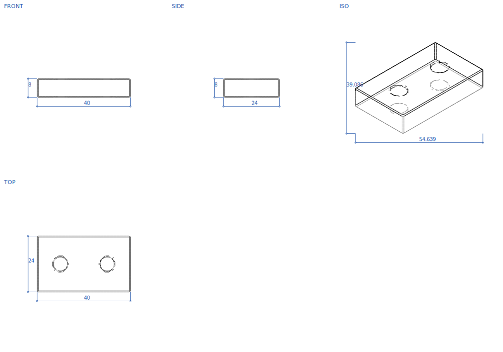

<h1 align="center">HarnessCAD</h1>

<p align="center">
  An agentic text-to-CAD harness: CAD operations are verified before the kernel runs them.
</p>

<p align="center">
  <a href="docs/blueprint.md">Architecture</a> ·
  <a href="docs/corpus/paper-ideas.md">186 papers</a> ·
  <a href="docs/corpus/repo-ideas.md">70 repos</a> ·
  <a href="#the-finding">The finding</a>
</p>

An agent asks for a 20x10x5 plate, fillets it with radius 8, and shells it with
thickness 9. Every operation is individually well-formed. A CAD kernel accepts
them and returns a solid that is quietly meaningless: the wall consumes the part.

HarnessCAD answers before the kernel is called.

```text
$ harnesscad apply examples/infeasible_plate.json --verify full

[warning] preflight-RADIUS_TOO_LARGE: Fillet radius 8 exceeds half the smallest extent (5) of 'model'.
                                      (Reduce the radius below 2.5.) @op[3]:fillet
[warning] preflight-THICKNESS_TOO_LARGE: Shell thickness 9 leaves no cavity in 'model' (smallest extent 5).
                                      (Reduce the thickness below 2.5.) @op[4]:shell
[error]   infeasible-plan: shell thickness 9 mm >= available stock 5 mm; the wall consumes the whole solid. @op[4]
```

The agent gets a named error to fix, not a stack trace to resample against.

## What this is not

- **Not a model.** There is no trained checkpoint here, and no accuracy number to quote. The harness is the artifact.
- **Not a CAD kernel.** It ships a kernel-free geometry backend that is good enough to be useful and honest about its grid error. For production B-rep, use OCCT via the optional extra.
- **Not a benchmark leaderboard.** It runs benchmarks and refuses to average incompatible ones, which is a different thing.
- **Not finished.** 448 of 1,176 modules (38%) are still imported by nothing but their own test. That number is printed by `harnesscad capabilities --stats`, not estimated.
- **Not a paper reproduction.** The domain layer is drawn from 186 papers and 70 repositories, and no single one of them is the target.

## Quickstart

```bash
pip install -e .          # stdlib only, no required dependencies
harnesscad demo          # build and verify a constrained plate
```

Build a part, verify it, and write a real STL with no CAD kernel installed:

```bash
harnesscad export plate.stl --backend frep
```

```text
wrote: plate.stl  (403,084 bytes, 8,060 triangles)
volume 994.33   analytic 1000.0   (0.57% under, grid-limited)
closed 2-manifold: yes    genus: 0
```

Signed distance fields compose the ops, marching cubes meshes them, a half-edge
structure proves the result is watertight. No OCCT anywhere in that path.

The harness also draws its own output. This is a real multi-view engineering
drawing, generated from the mesh above by `harnesscad export part.svg`: feature
edges extracted, hidden lines removed with a BVH, dimensions taken in model units.

<p align="center">
  
</p>

The holes facet because marching cubes samples a uniform grid, and a 6 mm hole
spans only ten cells on a 40 mm part. Raising the resolution smooths them at the
cost of a denser mesh. That trade is the honest shape of a kernel-free backend,
and it is why OCCT remains available as an optional extra.

## The finding

Reading 186 text-to-CAD papers and 70 CAD repositories end to end surfaced
something the field has not reckoned with, and it is the reason this repository
is shaped the way it is.

**Published metrics that share a name do not share a definition.** Six
implementations of "chamfer distance", all from the literature, run on the *same
two point clouds*:

| metric | value | normalisation |
|---|---|---|
| `chamfer_unit_sphere` | 0.0250 | unit sphere |
| `chamfer_unit_cube` | 131.14 | unit cube |
| `chamfer_bbox_judged` | 0.0382 | centroid + max bbox extent, judge-gated |
| `chamfer_raw` | 0.2069 | none |
| `chamfer_scaled_step` | 0.1005 | STEP-scaled |
| `chamfer_orientation_aligned` | 0.1443 | pose-aligned |

Four orders of magnitude, from normalisation alone. Two papers reporting "chamfer
distance" are frequently not comparable, and neither paper says so.

The same holds for tokenisers. DeepCAD quantises to 256 levels with round-half-even;
SkexGen truncates to 6 bits, biasing every coordinate down half a bin; HNC-CAD
swaps continuous rotation for a 25-frame codebook that is neither the 24 proper
rotations nor orthonormal; Vitruvion dequantises at the bin centre and is the only
one in the corpus with unbiased round-trip error.

**So the code refuses to blend them.** This is the load-bearing design decision:

```python
run_suite("deepcad", samples)    # selects chamfer_unit_sphere
run_suite("cadrille", samples)   # selects chamfer_unit_cube

Suite("mine", metrics=["chamfer_unit_sphere", "chamfer_bbox_judged"])
# RivalBlendError, raised at definition time. A blending suite cannot be built.
```

```bash
harnesscad ingest tokens.json --family skexgen
# error: sequence is tagged family 'deepcad' but the 'skexgen' dequantiser was
# requested; quantiser families are mutually incompatible and are never blended
```

A finding became an invariant. Rivals are selected by name, never averaged, and
the filenames carry the disagreement: `chamfer_unit_sphere.py` sits beside
`chamfer_bbox_judged.py` because the difference between them is the point.

## How it works

Geometry is a typed op stream rather than generated code, so it can be checked
before it is built. `HarnessSession` validates each op against a contract, runs a
fleet of 23 verifiers over the plan while it is still cheap to change, and returns
typed diagnostics instead of exceptions. The stream is content-digested and
event-sourced, so a model can be replayed, diffed, edited, or ingested back from a
mesh, a drawing, or a token sequence.

```python
from harnesscad.core.loop import HarnessSession
from harnesscad.io.backends.frep import FRepBackend

session = HarnessSession(FRepBackend(), verify_level="full")
result  = session.apply_ops(ops)
result.ok, result.digest, result.diagnostics
```

Everything else hangs off registries that discover their modules from a static AST
index, so a capability that leaves the tree leaves the surface:

```bash
harnesscad spec        --brief "a 20x10x5 plate with a 3mm hole"  # brief -> checked spec
harnesscad ingest      tokens.json --family deepcad        # tokens -> editable ops
harnesscad reconstruct --from point_cloud --to primitives  # 114 routes
harnesscad program     --lang openscad --validate part.scad
harnesscad export      part.stl                            # stl glb amf obj step svg
harnesscad bench       --suite deepcad --input runs.json
harnesscad report                                          # mass, pose, tolerance, DFM
harnesscad capabilities --tag sdf
```

## Where the code lives

```text
src/harnesscad/
  core/       the op spine: contract, loop, pipeline, digest, CLI
  domain/     geometry, numerics, reconstruction, CAD program analysis
  io/         formats, ingestion, backends, protocol surfaces
  eval/       verifiers, benchmarks, quality analysis
  agents/     agent loop, LLM layer, generation, RAG, memory
  data/       dataset engine, generators, the training flywheel
tests/        mirrors src/ exactly
```

Modules are named for what they do, not for the paper they came from, with one
deliberate exception: where provenance *is* the meaning, it stays.
`reconstruction/tokens/` holds `deepcad_quantize.py` next to `skexgen_quantize.py`
because they disagree, and the disagreement is the finding.

## Status

Wiring the modules into real call paths found five bugs in code that already
existed and already passed its own unit tests: an STL exporter that wrote binary
and read it back as UTF-8, a format advertising a codec it does not ship, a mesher
producing non-manifold output when a face landed on a sample plane, a metric
adapter that errored on every input it was ever given, and a "3D" contourer that
only implements the 2D case. None were reachable, so none were caught.

The 38% that remain unwired are reported with reasons rather than given fabricated
call sites. Reinforcement-learning losses have no trainer here. Some modules need a
renderer or human annotators that do not exist. Roughly 105 benchmark entries are
dataset manifests and judge scaffolding, not metrics, and were never going to fit a
`score(pred, gold)` seam.

Two known correctness questions are recorded rather than quietly resolved, in
[`docs/corpus/repo-ideas.md`](docs/corpus/repo-ideas.md).

Stdlib-only, deterministic: no wall clock, seeded randomness.

## Install

```bash
pip install -e .                 # core, no required dependencies
pip install -e ".[cadquery]"     # OCCT geometry backend
pip install -e ".[llm]"          # LLM planner
pip install -e ".[constraints]"  # SolveSpace sketch solver
```

Python >= 3.10. Provider keys are read from the environment and never stored.

Run one test module at a time; a monolithic `unittest discover` segfaults at OCCT
teardown:

```bash
python -m unittest tests.domain.geometry.sdf.test_primitives
```

## License and citation

MIT. HarnessCAD reproduces no single paper. Its domain layer is drawn from 186
papers and 70 repositories, and each module's originating work is attributed in the
[corpus ledgers](docs/corpus/paper-ideas.md). Cite the originating work for the
capability you use, not this repository.
